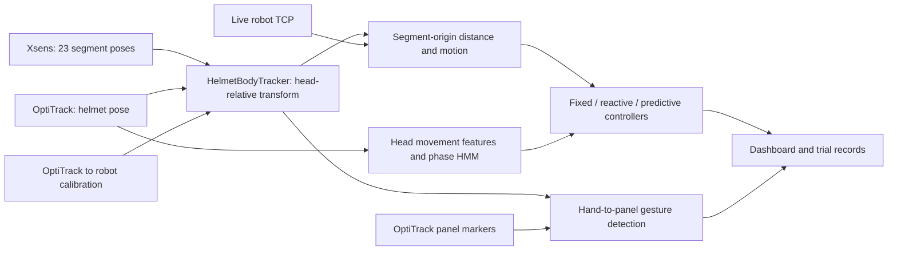

# Human–robot collaboration: Xsens, OptiTrack and adaptive separation control

Research software for a Monash University final-year project investigating human–robot ceiling-panel installation with a UR10 CB3 and a lightweight panel surrogate. The system combines an OptiTrack helmet pose with an articulated Xsens skeleton, extracts movement features, and compares fixed-zone, reactive and predictive control.

**Start with the [Xsens + OptiTrack integration tutorial](docs/helmet-xsens-integration.md).** It explains coordinate transforms, quaternion conventions, timing checks and implementation, with an executable example that requires no lab equipment.

| I want to… | Start here |
|---|---|
| Understand how the two tracking systems are combined | [Integration tutorial and worked example](docs/helmet-xsens-integration.md) |
| Run the code without hardware | [Quickstart below](#run-without-hardware) |
| Understand the controllers and data flow | [System architecture](docs/architecture.md) |
| Reproduce simulations, model checks or the paper | [Reproducibility guide](docs/reproducibility.md) |
| Find setup, capture and historical lab documentation | [Documentation index](docs/README.md) |
| Review the research | [Paper PDF](paper/main.pdf), [presentation](presentation/FYP-assessment-presentation-v2.pptx), [team review](docs/final-review.md) |
| Contribute or build on this work | [Contribution guide](CONTRIBUTING.md) |

## What this project provides

- A Python parser for Xsens MXTP02 position/quaternion packets and a NatNet 4 receiver for OptiTrack rigid bodies and marker sets.
- A helmet-anchored, 23-segment body representation in OptiTrack and robot-base coordinates.
- Three separation controllers, phase recognition using a Gaussian-mixture HMM, and a separate kinematic boundary-breach predictor.
- A local experiment dashboard, recording and task-sequencing code, offline analysis, and the canonical LaTeX manuscript.

This is a research prototype. Its distance calculation uses tracked segment origins and a vertical column beneath the robot TCP; it does not represent complete human, robot or panel surfaces. Robot commands use ordinary RTDE speed scaling and Dashboard pause, which are not safety-rated outputs. Software tests establish implementation behaviour, not physical safeguarding performance.

## Run without hardware

Use **Python 3.12** for the development path. Run these commands from the repository root. The package declares Python 3.10+ compatibility; other versions need their own validation.

Windows PowerShell:

```powershell
py -3.12 -m venv .venv
.venv\Scripts\python.exe -m pip install -e ".[dev]"
.venv\Scripts\python.exe scripts/demo_sensor_fusion.py
.venv\Scripts\python.exe -m pytest tests/test_sensor_fusion_demo.py tests/test_body_tracking.py
```

macOS / Linux:

```bash
python3.12 -m venv .venv
.venv/bin/python -m pip install -e ".[dev]"
.venv/bin/python scripts/demo_sensor_fusion.py
.venv/bin/python -m pytest tests/test_sensor_fusion_demo.py tests/test_body_tracking.py
```

The example prints transformed segment positions, shows that a common Xsens translation offset cancels, and demonstrates rejection of stale or incomplete input. It uses the production parser and body tracker with explicitly synthetic inputs. It opens no sockets and sends no robot commands.

In later examples, `python` means the Python executable in this environment. To explore the controller simulation:

```text
python scripts/run_simulation.py
python scripts/live_run.py --selftest
```

Simulation writes synthetic decision logs to `data/logs/` and metrics to `data/analysis/metrics.json`; it may replace the committed simulation examples there. These outputs are separate from the empirical manuscript. See [reproducibility](docs/reproducibility.md) before using a replay command or rebuilding study results.

## How the streams meet



The combination is a geometric anchoring transform. It removes a common Xsens translation offset by expressing segment positions relative to the Xsens head, then places that skeleton using the tracked helmet. Source freshness is checked, but the streams are not hardware-clock synchronized or temporally interpolated. The [tutorial](docs/helmet-xsens-integration.md) gives the equations and limitations.

## Research and manuscript

**Evaluating Safety and Coordination in Context-Aware Speed and Separation Monitoring for Human–Robot Ceiling-Panel Installation** — Zenan Wu, Luke Siniakov and Michael Magila, Monash University, 2026. Primary supervisor: Associate Professor Yihai Fang. Technical and laboratory support: Yizhe (Will) Wang.

The manuscript reports prototype integration, model-development validation, and exploratory telemetry and questionnaire findings. It does not establish a statistically supported controller ranking. See the methods and limitations in the [paper](paper/main.pdf) for the analysed samples and scope.

[`paper/main.tex`](paper/main.tex) is the canonical manuscript; Google Docs is a team review copy. The repository includes generated empirical tables and figures so the paper can be compiled without private study records. Full analysis requires the controlled-access inputs described in [paper/README.md](paper/README.md). Existing development recordings in `data/` are distinct from the final study inputs; see the [data guide](data/README.md).

```text
python -m pip install -e ".[paper]"
python scripts/build_paper.py --compile-only --engine /path/to/tectonic
```

`latexmk` is also supported. Omit `--engine` when a supported engine is on PATH. The manuscript is a project paper, not a claim of journal acceptance. The [assessor preparation guide](docs/assessor-preparation.md) explains the main technical questions.

## Repository map

| Directory | Contents |
|---|---|
| [`src/hrc_safety/`](src/hrc_safety/) | Tracking, features, controllers, HMM, robot interfaces and simulation |
| [`scripts/`](scripts/) | Entry points for demonstrations, experiments, calibration and analysis |
| [`tests/`](tests/) | Parser, geometry, control, capture and dashboard regression tests |
| [`configs/`](configs/) | Prototype parameters and the recorded lab calibration |
| [`dashboard/`](dashboard/) | Browser-based experiment console |
| [`data/`](data/README.md) | Development artifacts, model snapshots and synthetic examples |
| [`docs/`](docs/README.md) | Learning guides, operational runbooks and historical records |
| [`paper/`](paper/README.md) | Canonical LaTeX manuscript and generated assets |
| [`presentation/`](presentation/) | Assessment slides and rehearsal guide |

For physical installation, use the [Windows handoff](docs/windows-lab-2026-09-16.md) and [automatic-trial qualification guide](docs/automatic-trial-qualification.md). The saved IP addresses, helmet mounting assumptions, taught poses and extrinsics describe one installation; they must be checked for a different lab. One-off motion scripts and dated lab notes are preserved for provenance, not presented as a new installation's quickstart.
