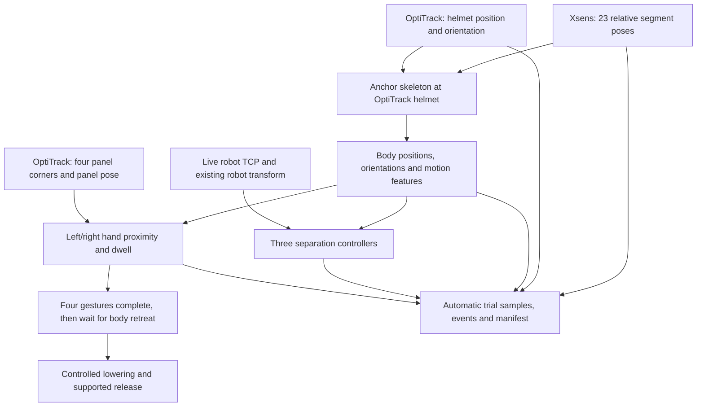

The local revision now uses OptiTrack helmet pose to anchor all 23 streamed Xsens body segments. The anchored hands drive four-corner gesture detection, and anchored segment positions and velocities inform the three separation controllers. The loaded historical phase HMM remains a head-input model; support for a separately trained body-input model is implemented, but no such model has been fitted or promoted.

The user confirmed on 9 September 2026 that the Motive helmet axes were aligned to the wearer's head. The configured mounting rotation therefore starts as identity. The helmet pivot is used as a head-position proxy with zero anatomical offset. This is an explicit approximation, not a measured head-center offset. Before collecting the revised study, check that the displayed hand-to-corner distances agree with the actual wearer reaching the panel. If there is a systematic displacement, measure the fixed helmet-pivot-to-head offset and enter it once in `helmet_body.head_origin_in_helmet_m`. Existing suit calibration and OptiTrack-to-robot extrinsics still apply; the integration does not require a separate global Xsens-to-room alignment procedure.



For each source pair, let R_H be the helmet orientation in OptiTrack, R_X be the Xsens head orientation, M be the fixed head-to-helmet mounting rotation, and o be the head-origin offset in helmet coordinates. The transform is:

```
R = R_H M transpose(R_X)
anchor = helmet_position + R_H o
joint_in_OptiTrack = anchor + R (joint_in_Xsens - head_in_Xsens)
joint_in_robot = existing_robot_rotation joint_in_OptiTrack + existing_robot_translation
```

Subtracting the Xsens head position removes its global translation drift. Dividing out the Xsens head orientation before applying the helmet orientation prevents a head turn from rotating the entire skeleton incorrectly. A test explicitly exercises head-only turning with the arms stationary. Every segment orientation is transformed too. Protocol parsing uses Xsens segment IDs 7 for the head, 11 for the right hand and 15 for the left hand, and handles Xsens wxyz versus NatNet xyzw quaternion ordering. See the [official Xsens streaming specification](https://www.xsens.com/hubfs/Downloads/Manuals/MVN_real-time_network_streaming_protocol_specification.pdf). Motive's rigid-body pivot and axes are configurable; see [OptiTrack rigid-body tracking](https://docs.optitrack.com/v3.0/motive/rigid-body-tracking).

Body tracking requires finite positions and valid orientations for all 23 segments, fresh helmet and Xsens input within 150 ms, and at most 50 ms difference in their receive ages. These are software freshness checks, not evidence of hardware clock synchronization. Original source identifiers and timestamps remain recorded. Velocities require advancing source frames with a gap no larger than 150 ms; a gap restarts velocity warm-up. Missing body input produces a zero-speed request in the default live path rather than silently substituting head-only control.

Control distance is the minimum distance from any tracked segment origin to the vertical column beneath the current live robot TCP. Closing speed is the greatest nonnegative human velocity projected toward that column across those origins; it can come from a different segment than the nearest one. This conservative aggregate does not represent body surfaces, tool tips, all robot links, or swept volumes. Finite-difference segment velocities also need a lab noise/latency check. The current predictor uses zero measured body acceleration plus its configured acceleration bound.

| Consumer | How Xsens is used now |
| --- | --- |
| Fixed-zone controller | Closest anchored segment origin selects its fixed distance zone. |
| Reactive SSM controller | Body distance and measured segment closing motion feed the dynamic envelope. |
| Predictive SSM controller | The same body geometry feeds envelope and kinematic prediction. The existing HMM phase estimate retains its trained head-input meaning. |
| Drilling task | Either anchored hand must remain within 0.12 m of each panel corner for 1 second. All four must complete. |
| Automatic retreat | All tracked segment origins must clear the configured launch distance before lift or lowering. |
| Recording | Raw streamed poses, transformed body poses, body features, controller geometry source and task events are saved together. |

The shared hard-red boundary remains in SSM mode. All three controllers should stop if a hand breaches it; model differences occur outside that boundary. Adding body input is not a reason to remove the common stop floor or claim that the old HMM has improved.

The four panel corners are matched in the panel's local coordinate frame, preserving their identity through panel movement and packet reordering. Hands, helmet, panel and markers must be fresh; the panel/marker/helmet frame identifiers must agree. Duplicate frames, interrupted dwells and alternating hands do not create completion. A changed corner geometry or source-clock reset prevents further gesture completion until observation restarts. Corner numbering is fixed by the first valid panel observation in each trial.

After four valid dwells, the state machine enters retreat automatically. It waits for the person and arms to move clear before lowering, then verifies low pose and stationary support before suction release. The dashboard shows 0–4 completed corners and nearest hand distances. There is no Task complete click in this automatic mode. Abort remains separate from progress controls and retains confirmation. The detector records `fastening_verified: false`: a held hand gesture cannot prove drilling, trigger activation or screw installation.

Start trial creates the session and sample/event files. The backend saves the streams it receives at its capture cadence, nominally 60 Hz; it does not archive every upstream packet at native sensor rate. Completion or abort writes the manifest. No native recording checkbox, manual filename or shared-sync click is required. Native `.mvn`, `.tak` and camera video are not fabricated by this capture path.

The optional body HMM contract is 12 inputs: the original four head features plus mean and maximum segment speed, trunk tilt, right and left reach, each hand's height above pelvis, and foot separation. Serialization, training, validation and live inference retain an explicit feature order. Missing required body features are rejected. Model-development runs with independent phase labels are eligible; participant evaluation runs, qualification runs and automatic machine cues are excluded from body training.

The audit of all 32 local P03–P05 pilot files found 214,187 rows, zero rows with all 23 raw segments and zero rows with body features. The head-body training readiness check consequently found zero complete eligible trials and wrote no model. New labelled development recordings and held-out evaluation are still needed before claiming a body-trained HMM. Today's participant recordings cannot simultaneously become training data and remain an untouched evaluation set.

Verification for this revision: 305 Python tests passed, with the actual UDP-listener test deliberately deselected. Six integrated API-to-file runs cover all three controllers in participant and qualification modes, using simulated sensor packets and robot/gripper responses. They complete four corners without a confirmation click, wait when a hand remains near the panel, and save the full stream records and events. Additional tests cover all 23 segment contributions, head-turn invariance, hand-inside-red stops, stationary-head/approaching-hand controller responses, source gaps, missing body input, corner reordering and body-feature model contracts. Dashboard build and lint passed. Full TypeScript checking still reports missing Cloudflare template declarations in the existing database/worker files; the local dashboard's API result type was corrected.

Delivery is local source only. The Central lab PC is off, so this revision has not been deployed or qualified with the real suit, helmet, panel, robot or gripper. No dashboard/sensor service was started on this PC and no network configuration was changed. The revised geometry and task rules define a new implementation/protocol version; they do not retroactively validate or change today's historical runs. Preserve those runs and report the implementation they actually used.
