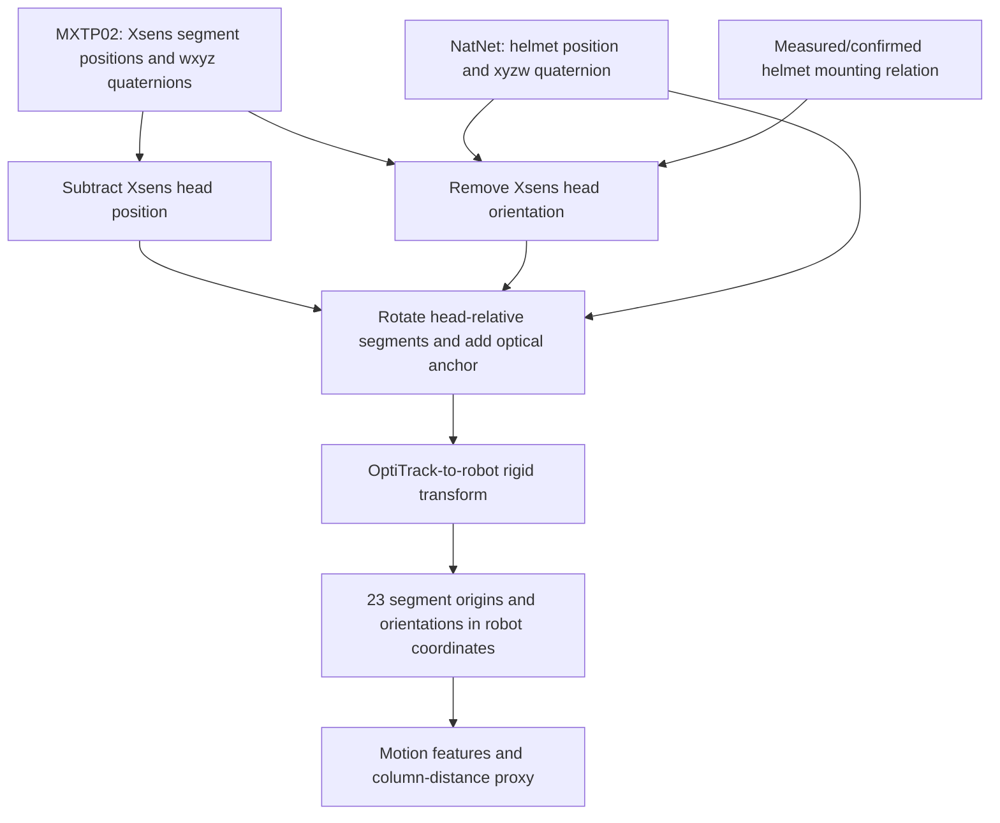

# Combining Xsens and OptiTrack: a practical tutorial

This guide explains the helmet-anchored body path implemented by [`HelmetBodyTracker`](../src/hrc_safety/body_tracking.py) and used by [the dashboard](../scripts/dashboard_server.py). It is intended for researchers reusing the tracking integration independently of the robot experiment.

**Run the complete worked example:** `python scripts/demo_sensor_fusion.py`. Install the environment in the [root quickstart](../README.md#run-without-hardware) first. All example poses are synthetic; the program uses the production MXTP02 parser and body tracker without opening a network connection.

## 1. What each sensor contributes

Xsens supplies articulated segment poses in its own coordinate frame. OptiTrack supplies the helmet rigid body's position and orientation in the camera system's world frame. The integration places the head-relative Xsens skeleton at the optical helmet and then transforms it into robot-base coordinates.

The implementation performs geometric anchoring of pose estimates. It does not combine raw accelerometer/gyroscope measurements with camera observations in a Kalman filter. It also does not keep the absolute body estimate valid through optical occlusion: stale helmet input is rejected.



## 2. Frames, units and conventions

| Symbol / field | Meaning |
|---|---|
| X | Xsens global frame |
| O | OptiTrack world frame |
| H | Helmet rigid body's local frame |
| A | Anatomical head segment's local frame |
| B | Robot-base frame |
| `position_m` | Position in metres, not millimetres |
| `quaternion_wxyz` | Xsens scalar-first quaternion |
| `rotation_xyzw` | NatNet/SciPy scalar-last quaternion |
| `head_to_helmet_rotation` | Rotation mapping A-local vectors into H-local vectors |
| `head_origin_in_helmet_m` | Vector from helmet pivot to anatomical head origin, expressed in H |
| `mocap_extrinsics.yaml: rotation, translation` | R_BO and t_BO: OptiTrack world to robot base |

Segment IDs are **one-based**: pelvis 1, head 7, right hand 11, left hand 15. Python array index 6 is head ID 7. The tracker expects all IDs 1–23; additional props/fingers do not replace missing body segments.

The saved configuration uses an identity head-to-helmet rotation and zero offset, so the helmet pivot acts as a head-origin proxy. Those are explicit mounting assumptions from this setup. They are not universal anatomical calibration values.

## 3. Derive the transform

Use column vectors in these equations. Let p_Xi and R_Xi describe segment i in Xsens coordinates, and let h identify the head. OptiTrack gives helmet pose p_OH, R_OH. The fixed mounting rotation is M_HA and the head-origin offset is o_H.

```text
R_OX = R_OH · M_HA · transpose(R_Xh)
a_O  = p_OH + R_OH · o_H

p_Oi = a_O + R_OX · (p_Xi - p_Xh)
R_Oi = R_OX · R_Xi

p_Bi = R_BO · p_Oi + t_BO
R_Bi = R_BO · R_Oi
```

Subtracting p_Xh cancels a translation applied equally to every Xsens segment. It does not remove errors in limb shape, individual segment orientation, or relative segment position. The inverse head rotation is essential: when the person turns only their head, both head/helmet orientations change, and their relative rotation prevents that head turn from incorrectly turning the entire skeleton.

NumPy stores the 23 positions as rows. Therefore the implementation writes `(p - p[6]) @ R_OX.T + anchor`, then `world @ R_BO.T + t_BO`. The transposes arise from row storage, not from a different physical transform.

### Worked numerical example

Choose an identity mounting rotation, zero head offset, identity Xsens head orientation, and a helmet rotated +90° about z.

```text
Xsens head:             [0.0,  0.0, 1.7] m
Xsens right hand:       [0.2, -0.3, 1.1] m
Head-relative hand:     [0.2, -0.3,-0.6] m
After +90° z rotation:  [0.3,  0.2,-0.6] m
Optical helmet:         [2.0,  3.0, 1.7] m
Anchored optical hand:  [2.3,  3.2, 1.1] m
Robot translation:     [-1.0,-2.0, 0.0] m (identity robot rotation)
Anchored robot hand:    [1.3,  1.2, 1.1] m
```

The [demo](../scripts/demo_sensor_fusion.py) calculates these values through the actual parser and tracker. It then adds a large common Xsens translation and turns only the head; both should preserve the hand's anchored position. A second advancing frame supplies motion features. Stale and incomplete observations are demonstrated separately.

To save the labelled demonstration output:

```text
python scripts/demo_sensor_fusion.py --out work/synthetic-fusion-demo.json
```

## 4. Connect the real streams

| Source | Dashboard receiver | Expected input |
|---|---|---|
| Xsens Analyze/Animate | `XsensListener`, UDP 9763 by default | MXTP02 position + quaternion; 23 body segments in a complete datagram |
| Motive | `NatNetV4Listener`, multicast UDP 1511 | NatNet 4 frame prefix containing rigid bodies and named marker sets |
| Robot | Dashboard RTDE telemetry | Finite, fresh live TCP in robot-base coordinates |

The Xsens parser retains packet counters, time code, avatar ID and all transmitted segments. It parses one datagram; it does not assemble body parts across multiple datagrams or select one person from multiple avatars. Configure one intended avatar and verify the complete 23-segment stream.

The dashboard currently constructs the optical listener with **head rigid-body ID 1**, local multicast interface **127.0.0.1**, and nominal optical rate **120 Hz**. The body lookup also uses ID 1. This matches a same-PC Motive receiver arrangement; a separate receiver PC needs an appropriate multicast interface and routing. These values are in `dashboard_server.py:main`, not exposed as dashboard CLI options. Changing the listener ID alone is insufficient unless the body lookup is updated too.

Use Motive's configured stream format and verify a real packet against the parser. This receiver parses the NatNet 4 prefix; it does not negotiate arbitrary NatNet versions. The optional `OptiTrackListener` class uses an external SDK sample and belongs to the older live/bench path. See [vendor notes](../vendor/README.md).

For installation and actual lab launch commands use the [Windows handoff](windows-lab-2026-09-16.md). Starting the dashboard creates sensor listeners and robot telemetry integration; it is not the hardware-free example.

Protocol references: [Xsens MVN streaming specification, revision N](https://www.xsens.com/hubfs/Downloads/Manuals/MVN_real-time_network_streaming_protocol_specification.pdf), [OptiTrack NatNet data types](https://docs.optitrack.com/developer-tools/natnet-sdk/natnet-data-types), and [Motive data streaming](https://docs.optitrack.com/motive/data-streaming). The statements about this repository's limits above come from its source, not a claim about every vendor configuration.

## 5. Timing: freshness is not synchronization

The dashboard takes the latest available input from each receiver. There is no buffered nearest-timestamp matching, interpolation or clock-offset estimation.

| Check / field | Implemented behaviour |
|---|---|
| Xsens receive age | Dashboard callback arrival measured with the receiver machine's monotonic clock |
| Helmet receive age | Time since the last accepted tracked rigid-body update |
| Freshness gate | Both ages must be finite, nonnegative and no more than 150 ms |
| Pair-age gate | Absolute difference between the receive ages must be no more than 50 ms |
| Xsens source time | MXTP02 millisecond time code converted to seconds |
| Optical `source_time_s` on the dashboard path | Frame number divided by configured nominal rate, not the native Motive capture timestamp |
| Velocity update | Both source identifiers must advance; finite differences use the Xsens source-time interval |
| Velocity gap | A new advancing pair with an interval over 150 ms clears velocity readiness |
| Clock going backwards | Reject the observation and reset tracker state |

An unchanged source pair does not generate a new velocity sample. The tracker can retain its previous velocity/features while the input remains within the freshness gates. Both streams can arrive nearly together despite different upstream delays; the 50 ms gate does not bound physical capture-time alignment.

For quantitative synchronization work, retain source IDs and receive times, measure latency with a shared observable event, estimate clock offsets/drift, and evaluate interpolation explicitly. Those are future extensions, not capabilities already supplied by this implementation. Use [recorded clock semantics](../data/README.md) when analysing existing data.

## 6. Calibration and physical checks

Three different calibrations/relations are involved:

1. **Xsens body calibration:** establishes the suit's segment geometry and poses.
2. **Helmet-to-head mounting relation:** establishes the pivot offset and axes used in the transform above.
3. **OptiTrack-to-robot extrinsics:** places the optical world in robot-base coordinates.

[`solve_handeye.py`](../scripts/solve_handeye.py) estimates world/base and TCP/panel transforms from multiple poses. Its `--out` flag can write a candidate without replacing the active configuration:

```text
python scripts/solve_handeye.py --infile data/calib/handeye_samples.jsonl --out work/example-extrinsics.yaml
```

This command refits the included historical samples; it does not calibrate a new lab. Independent validation values accepted by the script must come from measurements. The stored `accepted` flag is metadata, not a live guarantee. [`calibrate_mocap.py`](../scripts/calibrate_mocap.py) also contains a paired-point Kabsch solver; its `extrinsics --pairs` command writes the active extrinsics path, so use it deliberately.

Check a stationary wearer, translations along each room axis, body turns and head-only turns. Compare displayed hands against independently known locations through the working volume. Use hold-out poses to measure alignment error; repeat with representative motion to measure delay and noise. Helmet slip, suit drift, marker occlusion and moving the camera ground plane can all invalidate assumptions.

## 7. From body pose to controller input

For each anchored segment origin, the code finds the closest point on the vertical line segment beneath the current TCP, from z=0 to TCP height. It takes the smallest of these distances. Body velocity comes from successive transformed poses; the largest nonnegative projection toward the column becomes the closing-speed input. Robot velocity is not included in this projection.

This is a segment-origin/column proxy, not full surface clearance. Torso thickness, fingers beyond the hand origin, robot links, tool and panel surfaces, and swept volumes are not modelled. Optical anchoring also does not independently measure every limb's accuracy.

The existing HMM retains head-derived observations while body geometry can feed control. Qualification-mode and warm-up behaviour differ; read [the architecture guide](architecture.md) before assuming a record used body geometry. The default task uses anchored hands for corner gestures, which represent simulated progress rather than proof of drilling.

## 8. Troubleshoot by symptom

| Symptom | Check |
|---|---|
| Skeleton rotates when only the head turns | Xsens head ID, quaternion ordering, multiplication order and helmet mounting axes |
| Every segment has the same offset | Helmet pivot/head offset and optical-to-robot translation |
| Hands are mirrored or axes are swapped | Hand IDs 11/15, coordinate conventions and proper rotations; avoid ad hoc sign flips |
| Body available but motion features not ready | First sample, duplicate sources, source-time gap or reset |
| Body sources reported stale/skewed | Both receivers, arrival ages, NIC/multicast setup and upstream latency |
| Xsens packets arrive but body unavailable | IDs 1–23, valid unit quaternions, one avatar and complete datagrams |
| Head classification works but body control does not appear | Collection mode, body readiness and recorded `geometry_source` |
| Old fused command does not produce anchored joints | Use the dashboard/tracker path; older `live_run.py --source fused` only co-records the streams |

## 9. Verification and extension points

[`test_body_tracking.py`](../tests/test_body_tracking.py) checks transforms, translation cancellation, head-turn invariance, every segment's motion contribution, source faults, body feature contracts and hand-based controller responses. [The tutorial tests](../tests/test_sensor_fusion_demo.py) verify its numerical example and that the demonstrated path opens no sockets. These are software checks with synthetic input.

Useful next research steps are measured pose-error/latency evaluation, explicit temporal alignment, calibrated helmet offsets, uncertainty propagation and richer robot/body geometry. Each should be evaluated against independent measurements before being described as an improvement in physical accuracy or safety.
