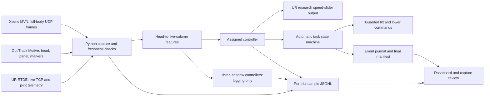

# System audit and technical guide — 9 September 2026

The offline software audit found and repaired real faults. The system is **not yet demonstrated ready for another final comparative participant session**. The Central Windows lab PC is off; these changes have not been deployed or tested against its robot, sensors and native recording applications.

Participant automation is implemented in the same guarded engine as rehearsal automation. There is no longer a Q-only software restriction. That answers whether the code can run automatically for participants; it does not establish model quality, physical stopping performance or validity of the earlier data.

## What this audit repaired

| Finding | Current behavior | Evidence |
|---|---|---|
| Dashboard feature extraction never refreshed the configured TCP reference | Each tick uses a finite, fresh live RTDE TCP pose, and records the same telemetry and geometry reference. Structured starts require it. Missing or stale geometry requests zero speed. | Moving only the simulated TCP changes the recorded distance and controller command. |
| Starting a trial cleared derivative history, and automation could fault before two new samples arrived | Loading waits up to 150 ms for feature warm-up, with no motion or phase advance. Other tracking and hardware checks remain active. | Full API-to-file cycles plus warm-up timeout and stale-input tests. |
| Inference or recording exceptions could kill the ticker without a visible persistent fault | Pipeline errors latch a zero-speed request and visible error; new trials are rejected until service restart. Output failure is reported as unconfirmed. | Simulated full-disk and corrupt telemetry tests. This cannot guarantee a physical stop if the output channel itself fails. |
| Invalid values could enter sensor/telemetry records | Non-finite sensor values and telemetry are rejected; sample JSON cannot contain NaN/Infinity. Xsens loss also invalidates feature extraction. | Packet-parser, stale-input and recording tests. |
| Capture grade alone advanced study progress | A slot needs explicit completed outcome and GOOD capture grade. An aborted or unproven run no longer fills the slot. | Legacy cached manifest regression; original grades and recordings remain unchanged. |
| Manifest creation could leave a partially written final JSON file | New manifests are written to a temporary file and replaced on successful write. | Existing complete-cycle persistence tests. This is not a claim of power-loss durability. |

Earlier changes in main added the Windows launcher, participant automation, explicit assigned/actual controller identities, participant counterbalancing, shared-input shadow decisions, event-exposure diagnostics and code/config/model fingerprints. This audit builds on commit `42fb2f7`.

## What the three conditions actually do

There are three **controllers**, but only one contains a trained HMM. The dashboard runs all three in `ssm` mode.

| Condition | Decision logic | Meaning |
|---|---|---|
| Fixed zone | Zero in red, 0.35 in yellow, 1 outside yellow | Distance zones alone |
| Reactive SSM | Dynamic bound based on measured human closing speed, plus the shared red stop | Can allow a larger speed fraction than fixed-zone outside red when someone is stationary or moving laterally |
| Predictive SSM | Reactive bound, kinematic boundary-breach prediction, and an HMM phase-based caution cap | Can reduce speed or stop earlier; it cannot grant a more permissive output than reactive SSM in this mode |

Saved defaults give red radius `1.6 × 0.40 + 0.20 + 0.10 = 0.94 m`, yellow radius `1.504 m`, and 0.05 m exit hysteresis. These are configured prototype values, not measurements of this installation's validated stopping distance.

The reactive dynamic threshold is `max(0, human_closing_speed) × 0.40 + 0.20 + 0.10`, with a 0.30 m ramp above it. Predictive control looks up to 0.5 s ahead using closing speed and acceleration; a closing gate of 0.6 m/s and sustained risk over two controller ticks prevent a phase label alone from becoming a hazard stop.

The offline witness script loads the actual configured pilot artifact and exercises the same controller factory:

| Synthetic input, after two ticks | Fixed | Reactive | Predictive |
|---|---:|---:|---:|
| Distance 0.8 m, stationary | 0 | 0 | 0 |
| Distance 1.1 m, stationary | 0.35 | 1 | 1 |
| Distance 1.6 m, closing at 1.5 m/s | 1 | 1 | 0 |

Values are requested speed-slider fractions, not measured robot speeds. These cases prove distinct software branches, not recognition accuracy or experimental superiority. The last row primarily demonstrates the kinematic predictor, not learned HMM anticipation.

**The common red stop still exists.** Expecting the HMM to permit close-proximity motion that the other controllers forbid does not match this live implementation. The simulation has other robot modes; the dashboard does not automatically switch the real robot into certified hand-guiding/compliance from an inferred human phase.

The active historical HMM's transition probabilities are effectively locked by the earlier transition-power treatment. Training was corrected, but the separately fitted candidate performed worse on the existing participant-held-out pilot data:

| Artifact | Causal online accuracy | Causal balanced accuracy |
|---|---:|---:|
| Active historical pilot HMM | 79.37% | 72.50% |
| Corrected training candidate | 74.41% | 68.54% |

The candidate has not been promoted. Neither reaches the current 80% causal release threshold. Corrected live geometry also requires consistent pilot feature extraction and fresh held-out validation. Today's evaluation trials must not become training data while also being presented as untouched evaluation evidence.

## The technical data path



**Sensors.** MVN supplies UDP Position + Quaternion packets (`MXTP02`, default port 9763). The parser retains all 23 body segments when supplied, including position and quaternion plus source counters. Motive supplies NatNet 4 data; the current launcher/backend expects Motive locally, using loopback for its multicast interface, tracked head ID 1, and panel/marker observations. Coordinate extrinsics convert the head position into robot-base coordinates.

**Timing.** The Python ticker targets 60 Hz by doing work and then sleeping for 1/60 s; it is not a hard real-time scheduler. Incoming streams are held at their latest tracked samples. Tracking older than 150 ms is invalid, and live robot geometry requires telemetry source age no greater than 250 ms. The bridge uses a monotonic tick clock with a minimum configured tick interval. The NatNet adapter currently derives source time from frame number divided by nominal 120 Hz; it does not decode an absolute synchronized Motive clock. The records also contain local monotonic and UTC recording times, Xsens time/counters and RTDE source time. These are multiple clocks, not proof of hardware synchronization.

**Features and HMM.** Live distance is from the tracked head to the vertical segment below the current TCP. Short least-squares windows estimate human velocity and acceleration. The four HMM observations are distance, projected human closing velocity, speed magnitude and velocity-heading alignment. The legacy field name `torso_facing` is heading alignment; it is not measured torso orientation. Xsens is captured, freshness-checked and used for hand observations in simulated drilling, but the HMM does not consume all 23 joint trajectories.

This geometry is a proxy. It does not measure minimum distance from every body part to every robot link or panel surface. `v_proj`, and therefore the legacy `d_dot = -v_proj`, describes human motion toward the current reference; it excludes robot velocity. It is not a full relative separation derivative when the robot moves.

**Output and task automation.** The assigned controller requests a UR RTDE speed-slider fraction. A successful write acknowledgment is recorded, while actual joint velocity and TCP telemetry provide separate evidence of motion. RTDE movement commands execute the taught low/top poses at the configured common joint speed. The VG10 path uses the existing gripper driver and cached health checks. The speed slider and dashboard command paths are research integration, not independent safety-rated stopping devices.

**Dashboard.** The React/Vinext dashboard on port 3000 proxies requests to the Python API on port 8765. The backend owns recording and task progression, so browser refresh does not define the trial state. Browser polling displays state; it does not clock the controller. The page exposes assignment, actual decision identity/rule, shared boundary, model warnings, geometry reference and pipeline faults.

## What still needs operator action

`Start-Lab.ps1` starts the local backend with research output and automatic trials enabled, starts the dashboard, and checks their API connection. It detects an already-running old or disabled backend instead of silently claiming automation is enabled. Starting these services does not start a trial or move the robot.

For a participant: select/create the P-code, complete intake, establish tracking/calibration, and press Start trial. The backend generates filenames, opens the sample/event files and journals the start timestamp itself. No native recording, filename confirmation or manual sync step is required. The common automatic cycle turns on suction, verifies sealing, waits for clearance, lifts, waits through the task, accepts the operator's task-complete confirmation, waits for clearance, lowers, verifies low stationary support and releases. Consent/forms, the planned event cue and task completion remain human actions.

Faults do not automatically vent suction or restart motion. The brief derivative warm-up is now handled before motion; it is not a bypass of the tracking or robot checks. This is why removing the historical rehearsal-only restriction was appropriate, but simply labeling a run “participant” cannot make missing live inputs or a failed output check valid.

The automatic capture mode saves streamed Xsens segments, OptiTrack tracking, robot telemetry, derived features, controller decisions and task events at the capture cadence. It **does not create `.mvn`, `.tak` or video files**; those formats are not prerequisites. Legacy supplied references are retained without claiming that their files exist. The simulated drilling detector can log visits/hand proximity; it does not independently prove that a real fastening task was completed. Survey links and optional completion integration support workflow; a displayed/opened form is not itself evidence of a submitted response.

## How one trial is saved

| File | Contents | Limit |
|---|---|---|
| `session.jsonl` | One row per captured ticker sample: IDs, assignment, sensor data, features, model state, actual and shadow decisions, output acknowledgment, robot telemetry, timestamps, geometry reference and event/phase labels | Capture rate and source rates differ; cued labels are not independent human annotations |
| `session.events.jsonl` | Start/stop, automation contract, task transitions, command changes, sync markers and exposure/task observations | Records software events, not an independent physical observer |
| `session.manifest.json` | Outcome, filenames, counts, condition, execution mode, model/code/config fingerprint, exposure review and capture summary | File references do not prove native files exist or are synchronized |
| Optional native `.mvn`, `.tak`, `.mp4` | External sources if deliberately collected | Not created or required by automatic stream capture |

The sample file is flushed each tick. The final manifest uses a temporary write and replacement. Capture grading checks duration/rate, stale fraction, labels/events and completion rules. It is not a scientific acceptance decision. Preserve raw originals, then produce separately versioned derived data and documented exclusions/annotations.

## What can be said about today's results

The earlier session inventory reports 55 attempts, 50 completed and five aborted. Those counts establish recorded workflow outcomes, not 50 valid final comparisons. The raw audit here covers **only P17 T05–T09**; no conclusion about every trial or the predictive block follows from that subset.

In those recovered samples, T05/T06 record `static` decisions, while T07/T08/T09 record `dynamic_ssm`. This contradicts “all three blocks definitely executed static” for the audited fixed/reactive runs. The predictive block's raw samples were not recovered. Inventory assignments also show different orders across P13–P17; A/B/C are positions whose display order stays constant. UI ambiguity and common stop behavior can still explain the operator experience.

The new geometry audit recomputes the same column proxy from recorded head position and same-row fresh TCP:

| Trial | Median absolute discrepancy | Maximum absolute discrepancy |
|---|---:|---:|
| P17 T05 | 9.4 cm | 73.6 cm |
| P17 T06 | 10.1 cm | 71.2 cm |
| P17 T07 | 8.7 cm | 79.9 cm |
| P17 T08 | 11.5 cm | 75.1 cm |
| P17 T09 | 8.2 cm | 66.6 cm |

These are discrepancies in recorded computation, not independently measured clearance errors. They confirm that stored distance and the recorded moving reference differ materially. Earlier distance/closing-based cue diagnostics are therefore provisional and must be revisited with corrected geometry and video/native alignment.

Keep today as the original implementation version. Some recordings may support descriptive results or a carefully scoped analysis after review. Do not presently call the session final valid evidence that one controller outperforms another. Recomputing features can improve analysis; it cannot change the commands participants actually experienced. Do not silently pool patched and historical trials or discard unfavorable results to improve a comparison.

## Verification and remaining limits

The updated audit passed **266 Python tests**, with the UDP-listener test deliberately deselected, plus dashboard production build and lint. Six integrated cases exercise API dispatch, parsed MVN/NatNet packets, live-geometry extraction, all three controller assignments, both P/Q modes, automatic task progression, output mocks and saved trial files, without supplying any native recording confirmation, filenames or manual sync marker. No network listeners or hardware were used for those six tests. Three synthetic controller witnesses also passed with the active pilot model.

Commands, from the repository using its Python environment:

```text
python -m pytest tests -q -k "not test_udp_listener_feeds_bridge_end_to_end" -o addopts=""
python scripts/verify_controller_behaviour.py --output <witness.json>
python scripts/audit_recorded_trials.py <recovered-sample-directory> --output <audit.json>
```

Build and lint run in `dashboard` with `npm run build` and `npm run lint`. Browser interaction, network transports, native recorder control, the real arm/gripper, pose/calibration accuracy, observed stop latency and physical event execution are outside this offline verification. A guarded lab commissioning cycle and a held-out model/experiment validation remain necessary work, with the Central PC and team present.

No network adapter, IP, DNS, firewall or VPN setting was changed on the home PC. After the League interruption, the audit used offline tests and builds and did not start dashboard/sensor services. The observed game-server timeout is not enough to identify its cause.
